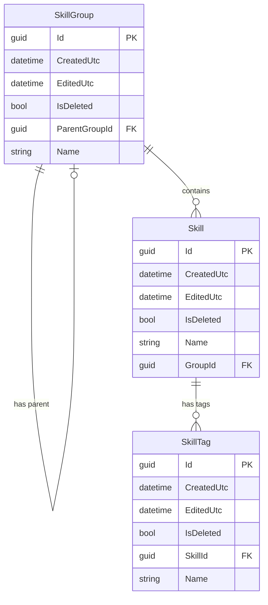
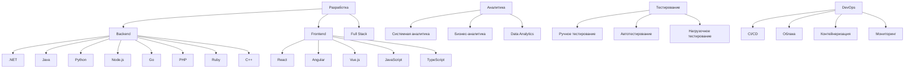

## 1. Диаграмма структуры данных

```mermaid
erDiagram
    SkillGroup ||--o{ SkillGroup : "has children"
    SkillGroup ||--o| SkillGroup : "has parent"
    SkillGroup ||--o{ Skill : "contains"
    Skill ||--o{ SkillTag : "has tags"

    SkillGroup {
        guid Id PK
        datetime CreatedUtc
        datetime EditedUtc
        bool IsDeleted
        guid ParentGroupId FK
        string Name
    }

    Skill {
        guid Id PK
        datetime CreatedUtc
        datetime EditedUtc
        bool IsDeleted
        string Name
        guid GroupId FK
    }

    SkillTag {
        guid Id PK
        datetime CreatedUtc
        datetime EditedUtc
        bool IsDeleted
        guid SkillId FK
        string Name
    }
```

---

## 2. Иерархия групп и навыков (Seed Data)

```mermaid
graph TD
    A[Разработка] --> A1[Backend]
    A --> A2[Frontend]
    A --> A3[Full Stack]
    
    A1 --> A1a[.NET]
    A1 --> A1b[Java]
    A1 --> A1c[Python]
    A1 --> A1d[Node.js]
    A1 --> A1e[Go]
    A1 --> A1f[PHP]
    A1 --> A1g[Ruby]
    A1 --> A1h[C++]
    
    A2 --> A2a[React]
    A2 --> A2b[Angular]
    A2 --> A2c[Vue.js]
    A2 --> A2d[JavaScript]
    A2 --> A2e[TypeScript]
    
    B[Аналитика] --> B1[Системная аналитика]
    B --> B2[Бизнес-аналитика]
    B --> B3[Data Analytics]
    
    C[Тестирование] --> C1[Ручное тестирование]
    C --> C2[Автотестирование]
    C --> C3[Нагрузочное тестирование]
    
    D[DevOps] --> D1[CI/CD]
    D --> D2[Облака]
    D --> D3[Контейнеризация]
    D --> D4[Мониторинг]
```

---
